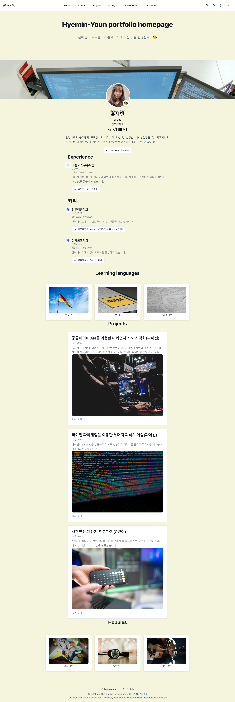

본 콘덴츠는 2024년 2학기 웹서비스설계 수업의 과제1 MARKDOWN언어 HUGO Website 생성을 위해 제작되었습니다.
# [Hyemin-Youn Portfolio Homepage](https://hyemin-youn.github.io/Hyemin-Youn.test.github.io/)

The Hugo **Résumé Template** empowers you to easily create your job-winning online résumé, showcase your expertise, and share your social profiles to grow your audience.

️**Trusted by 250,000+ researchers, educators, and students.** Highly customizable via the integrated **no-code, block-based website builder**, making every site truly personalized ⭐⭐⭐⭐⭐

  

[Check out the latest demo](https://hugo-resume-theme.netlify.app/) of what you'll get in less than 10 minutes, or [view the showcase](https://hugoblox.com/creators/).

The integrated [**Hugo Blox**](https://hugoblox.com) website builder and CMS makes it easy to create a beautiful website for free. Edit your site in the CMS (or your favorite editor), generate it with [Hugo](https://github.com/gohugoio/hugo), and deploy with GitHub or Netlify. Customize anything on your site with widgets, light/dark themes, and language packs.

- 👉 [**Get Started**](https://hugoblox.com/templates/)
- 📚 [View the **documentation**](https://docs.hugoblox.com/)
- 💬 [Chat with the **Hugo Blox Builder community**](https://discord.gg/z8wNYzb) or [**Hugo community**](https://discourse.gohugo.io)
- ⬇️ **Automatically import citations from BibTeX** with the [Hugo Academic CLI](https://github.com/GetRD/academic-file-converter)
- 🐦 Share your new site with the community: [@GetResearchDev](https://twitter.com/GetResearchDev) [@GeorgeCushen](https://twitter.com/GeorgeCushen) [#MadeWithHugoBlox](https://twitter.com/search?q=%23MadeWithHugoBlox&src=typed_query)
- 🗳 [Take the survey and help us improve #OpenSource](https://forms.gle/NioD9VhUg7PNmdCAA)
- 🚀 [Contribute improvements](https://github.com/HugoBlox/hugo-blox-builder/blob/main/CONTRIBUTING.md) or [suggest improvements](https://github.com/HugoBlox/hugo-blox-builder/issues)
- ⬆️ **Updating?** View the [Update Guide](https://docs.hugoblox.com/) and [Release Notes](https://github.com/HugoBlox/hugo-blox-builder/releases)

## We ask you, humbly, to support this open source movement

Today we ask you to defend the open source independence of the Hugo Blox Builder and themes 🐧

We're an open source movement that depends on your support to stay online and thriving, but 99.9% of our creators don't give; they simply look the other way.

### [❤️ Click here to become a GitHub Sponsor, unlocking awesome perks such as _exclusive academic templates and widgets_](https://github.com/sponsors/gcushen)

## Demo credits

- [Unsplash](https://unsplash.com/) images

사진: <a href="https://unsplash.com/ko/%EC%82%AC%EC%A7%84/%ED%99%94%EC%9D%B4%ED%8A%B8-%ED%85%8C%EC%9D%B4%EB%B8%94%EC%97%90%EC%84%9C-%EB%A7%A5%EB%B6%81-%ED%94%84%EB%A1%9C%EB%A5%BC-%EC%82%AC%EC%9A%A9%ED%95%98%EB%8A%94-%EC%82%AC%EB%9E%8C-uyfohHiTxho?utm_content=creditCopyText&utm_medium=referral&utm_source=unsplash">Unsplash</a>의<a href="https://unsplash.com/ko/@thisisengineering?utm_content=creditCopyText&utm_medium=referral&utm_source=unsplash">ThisisEngineering</a>
  
사진: <a href="https://unsplash.com/ko/%EC%82%AC%EC%A7%84/%EC%9B%B0%EC%BB%B4%EC%9D%98-3d-%ED%8E%98%EC%9D%B8%ED%8C%85-6wAGwpsXHE0?utm_content=creditCopyText&utm_medium=referral&utm_source=unsplash">Unsplash</a>의<a href="https://unsplash.com/ko/@bel2000a?utm_content=creditCopyText&utm_medium=referral&utm_source=unsplash">Belinda Fewings</a>
  
사진: <a href="https://unsplash.com/ko/%EC%82%AC%EC%A7%84/%ED%99%94%EC%9D%B4%ED%8A%B8%EC%99%80-%EB%B8%94%EB%9E%99-%EC%B2%B4%ED%81%AC-%EB%AC%B4%EB%8A%AC-z8y36JocqkU?utm_content=creditCopyText&utm_medium=referral&utm_source=unsplash">Unsplash</a>의<a href="https://unsplash.com/ko/@timmossholder?utm_content=creditCopyText&utm_medium=referral&utm_source=unsplash">Tim Mossholder</a>

사진: <a href="https://unsplash.com/ko/%EC%82%AC%EC%A7%84/%EA%B2%80%EC%9D%80-%EC%95%84%EC%9D%B4%ED%8F%B0-5%EB%A5%BC-%EB%93%A4%EA%B3%A0-%EC%9E%88%EB%8A%94-%EC%82%AC%EB%9E%8C-HQSEvyN56K0?utm_content=creditCopyText&utm_medium=referral&utm_source=unsplash">Unsplash</a>의<a href="https://unsplash.com/ko/@solenfeyissa?utm_content=creditCopyText&utm_medium=referral&utm_source=unsplash">Solen Feyissa</a>
  
사진: <a href="https://unsplash.com/ko/%EC%82%AC%EC%A7%84/%EB%B9%84%EB%94%94%EC%98%A4-%EA%B2%8C%EC%9E%84%EC%9D%84-%ED%95%98%EB%8A%94-%EB%8F%99%EC%95%88-%EA%B2%8C%EC%9E%84%EC%9A%A9-%EC%9D%98%EC%9E%90%EC%97%90-%EC%95%89%EC%95%84-%EC%9E%88%EB%8A%94-%EC%82%AC%EB%9E%8C-Mf23RF8xArY?utm_content=creditCopyText&utm_medium=referral&utm_source=unsplash">Unsplash</a>의<a href="https://unsplash.com/ko/@florianolv?utm_content=creditCopyText&utm_medium=referral&utm_source=unsplash">Florian Olivo</a>
  